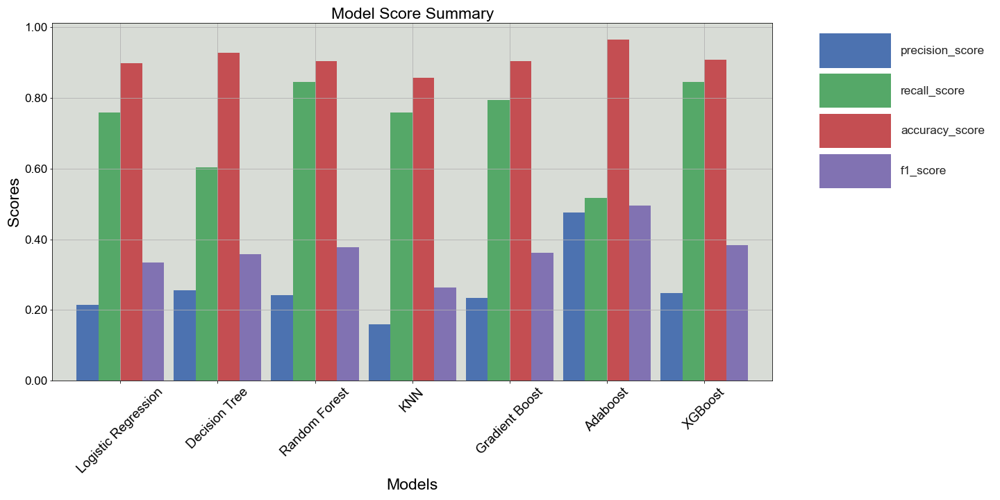
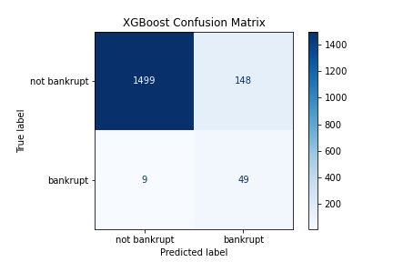
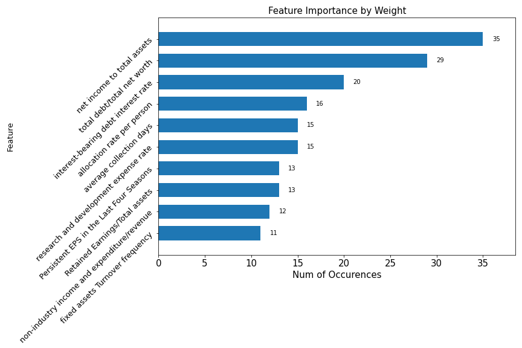
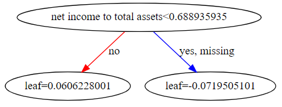

# A Look into the Past : Predicting Bankruptcies in Taiwan

Taiwan Rating's Agency is revamping their current bankruptcy models to ensure the financial stability of the companies listed on the Taiwan Stock Exchange. With the amount of volatility and bankruptcies currently being experienced due to Covid, they would like to conduct a review of the Taiwanese companies that went bankrupt over the '99 - '09 time period and create a model that can predict future companies insolvency.

## Data

Data used in this project was collected from the Taiwan Economic Journal for the years 1999 to 2009. Company bankruptcy was defined based on the business regulations of the Taiwan Stock Exchange. The link to was found on Kaggle and is below for reference

https://www.kaggle.com/fedesoriano/company-bankruptcy-prediction|

**Column Names and descriptions for Taiwanese Bankruptcy Data**

    Y - Bankrupt?: Class label
    1 - ROA(C) before interest and depreciation before interest: Return On Total Assets(C)
    2 - ROA(A) before interest and % after tax: Return On Total Assets(A)
    3 - ROA(B) before interest and depreciation after tax: Return On Total Assets(B)
    4 - Operating Gross Margin: Gross Profit/Net Sales
    5 - Realized Sales Gross Margin: Realized Gross Profit/Net Sales
    6 - Operating Profit Rate: Operating Income/Net Sales
    7 - Pre-tax net Interest Rate: Pre-Tax Income/Net Sales
    8 - After-tax net Interest Rate: Net Income/Net Sales
    9 - Non-industry income and expenditure/revenue: Net Non-operating Income Ratio
    10 - Continuous interest rate (after tax): Net Income-Exclude Disposal Gain or Loss/Net Sales
    11 - Operating Expense Rate: Operating Expenses/Net Sales
    12 - Research and development expense rate: (Research and Development Expenses)/Net Sales
    13 - Cash flow rate: Cash Flow from Operating/Current Liabilities
    14 - Interest-bearing debt interest rate: Interest-bearing Debt/Equity
    15 - Tax rate (A): Effective Tax Rate
    16 - Net Value Per Share (B): Book Value Per Share(B)
    17 - Net Value Per Share (A): Book Value Per Share(A)
    18 - Net Value Per Share (C): Book Value Per Share(C)
    19 - Persistent EPS in the Last Four Seasons: EPS-Net Income
    20 - Cash Flow Per Share
    21 - Revenue Per Share (Yuan ¥): Sales Per Share
    22 - Operating Profit Per Share (Yuan ¥): Operating Income Per Share
    23 - Per Share Net profit before tax (Yuan ¥): Pretax Income Per Share
    24 - Realized Sales Gross Profit Growth Rate
    25 - Operating Profit Growth Rate: Operating Income Growth
    26 - After-tax Net Profit Growth Rate: Net Income Growth
    27 - Regular Net Profit Growth Rate: Continuing Operating Income after Tax Growth
    28 - Continuous Net Profit Growth Rate: Net Income-Excluding Disposal Gain or Loss Growth
    29 - Total Asset Growth Rate: Total Asset Growth
    30 - Net Value Growth Rate: Total Equity Growth
    31 - Total Asset Return Growth Rate Ratio: Return on Total Asset Growth
    32 - Cash Reinvestment %: Cash Reinvestment Ratio
    33 - Current Ratio
    34 - Quick Ratio: Acid Test
    35 - Interest Expense Ratio: Interest Expenses/Total Revenue
    36 - Total debt/Total net worth: Total Liability/Equity Ratio
    37 - Debt ratio %: Liability/Total Assets
    38 - Net worth/Assets: Equity/Total Assets
    39 - Long-term fund suitability ratio (A): (Long-term Liability+Equity)/Fixed Assets
    40 - Borrowing dependency: Cost of Interest-bearing Debt
    41 - Contingent liabilities/Net worth: Contingent Liability/Equity
    42 - Operating profit/Paid-in capital: Operating Income/Capital
    43 - Net profit before tax/Paid-in capital: Pretax Income/Capital
    44 - Inventory and accounts receivable/Net value: (Inventory+Accounts Receivables)/Equity
    45 - Total Asset Turnover
    46 - Accounts Receivable Turnover
    47 - Average Collection Days: Days Receivable Outstanding
    48 - Inventory Turnover Rate (times)
    49 - Fixed Assets Turnover Frequency
    50 - Net Worth Turnover Rate (times): Equity Turnover
    51 - Revenue per person: Sales Per Employee
    52 - Operating profit per person: Operation Income Per Employee
    53 - Allocation rate per person: Fixed Assets Per Employee
    54 - Working Capital to Total Assets
    55 - Quick Assets/Total Assets
    56 - Current Assets/Total Assets
    57 - Cash/Total Assets
    58 - Quick Assets/Current Liability
    59 - Cash/Current Liability
    60 - Current Liability to Assets
    61 - Operating Funds to Liability
    62 - Inventory/Working Capital
    63 - Inventory/Current Liability
    64 - Current Liabilities/Liability
    65 - Working Capital/Equity
    66 - Current Liabilities/Equity
    67 - Long-term Liability to Current Assets
    68 - Retained Earnings to Total Assets
    69 - Total income/Total expense
    70 - Total expense/Assets
    71 - Current Asset Turnover Rate: Current Assets to Sales
    72 - Quick Asset Turnover Rate: Quick Assets to Sales
    73 - Working capitcal Turnover Rate: Working Capital to Sales
    74 - Cash Turnover Rate: Cash to Sales
    75 - Cash Flow to Sales
    76 - Fixed Assets to Assets
    77 - Current Liability to Liability
    78 - Current Liability to Equity
    79 - Equity to Long-term Liability
    80 - Cash Flow to Total Assets
    81 - Cash Flow to Liability
    82 - CFO to Assets
    83 - Cash Flow to Equity
    84 - Current Liability to Current Assets
    85 - Liability-Assets Flag: 1 if Total Liability exceeds Total Assets, 0 otherwise
    86 - Net Income to Total Assets
    87 - Total assets to GNP price
    88 - No-credit Interval
    89 - Gross Profit to Sales
    90 - Net Income to Stockholder's Equity
    91 - Liability to Equity
    92 - Degree of Financial Leverage (DFL)
    93 - Interest Coverage Ratio (Interest expense to EBIT)
    94 - Net Income Flag: 1 if Net Income is Negative for the last two years, 0 otherwise
    95 - Equity to Liability

The above columns are the variables used to predict a companies bankruptcy using various classification models. They pertain to a spectrum of financial ratios and metrics used to value companies broadly.

## Business Problem

The main business concern for Taiwan Rating's Agency is to provide financial market intelligence locally in Taiwan and internationally as well. They also work closely with the Taiwan Stock Exchange in order to help ensure stability and soundness of the companies trading on the exchange to ultimately protect the end investors. Given the backdrop of the Global Pandemic, the creditworthiness of many companies has come under further review. Taiwan Rating's Agency is conducting a thorough review of all the constituents listed on the TSE (Taiwan Stock Exchange) to ensure if there are any companies on the brink of bankruptcy they can be delisted and moved to the OTC market. In order to appropriately assess these companies financial solvency, Taiwan Rating's Agency has tasked our group to create the best model possible capable of predicting future bankruptcy of a company.
    
To deliver for our client, we:
    
    1. Created several predictive classification models
    2. Optimized across all of our models to produce the best performing model
    3. Determined what features were predictive to a company's potential bankruptcy

## Methods

### Preprocessing

Given the '99-'09 Taiwan Company Bankruptcy data, our first step was to make sure that our data was clean. Fortunately for us, there were no issues with missing values or data type for any features. There was however a column 'contingent liabilities /net worth' with 60% of the companies having the same value of non-zero. I dropped this column as a result. Otherwise, there was nothing of note to be cleaned.

### Transformation

The first step taken here was address multicollinearity concerns. There were some 21 columns that were dropped due to having correlations above .80 which was not surprising as there are many ratios that have overlapping numerators or denominators that are the same within the financial metrics provided. 

Separately, converted our pre-processed data into our target (y) 'Bankrupt' variable and x 'predictors' and created training and test groups to use in our models. Our data had significant class imbalance issues that needed addressing as only 3.2% of the companies in our data went bankrupt over the 10 year period. To address this, we used smote to oversample our minority class in our training data.

Next, we scaled training and test predictors using a sigmoid function. This scaled our values into a range of 0 to 1.

### Data Mining

During our data mining phase we ran multiple classification models to isolate the best performing model at predicting bankruptcy for our companies. The models used were:

    - Logistic Regression
    - Decision Tree
    - Random Forest
    - K-Nearest Neighbors
    - Gradient Boost
    - Adaptive Boosted Forest
    - XGBoost
    
To evaluate our model performance, we prioritized the recall of our minority class which is to say what proportion of our actual bankrupt companies were correctly identified by our models. To note, in prioritizing recall we sacrificed the precision of our models.

## Results

We found that the best performing model by a slim margin was our XGBoosted tree.

No model was able to get above a .84 recall score for the minority class of our target variable, and all models sacrificed precision in order to maximize recall.

The below graph is a side by side of all of the models and respective scores accompanied by the data table.

Our XG boost model was able to identify correctly identify 48 out of 58 bankrupt companies, but in doing so led misclassifying 151 companies as bankrupt when they indeed were not.

Below is the corresponding confusion matrix and scores for our XG boost model.

To note, the top 10 features by weighting feature importance are below. The highest weighted feature was 'net income to total assets'. This isn't entirely surprising as compnaies that generate higher net income should be less likely to default. The top weighting is followed by 'total debt/total net worth' and 'interest-bearing debt interest rate' which falls in line with our base assumption. The larges

Below we have our tree from our XGBoosted model, which had a max depth of one so is a a bit underwhelming but here nonetheless it does shed light on when 'net income to total assets' is below .68 a company is more likely to go into default

For comparison, below is one of the trees that was created within our random forest model.

## Conclusion

In conclusion our XG Boosted Tree proved to be our best model at predicting a bankrupt company. In order to achieve its recall of .84, as with all other models, precision took a substantial nosedive.

Analyzing feature importance, 'net income to assets' and 'total debt/total net worth' stood out by far as the most important features to predicting a company's bankruptcy.

To note, even with a highly imbalanced data set, by using smote resampling we were able to train our models to be able to more accurately predict bankruptcy as well, which is no easy feat as our only 3% of the companies in our dataset were default.

### Future Work

The scope of this project was to predict bankruptcy of a company given a many financial ratios and metrics. Future work would include a broader covering list of features including not only ratios but stand alone line items as well. With this, it would be interesting to look at not only potential bankruptcy but credit ratings and related prices of such tradeable instruments.

Lastly, it would be interesting to be able to assess the change in a QoQ earnings report how much of an increase or decrease there would be in either credit rating or likelihood of default.
